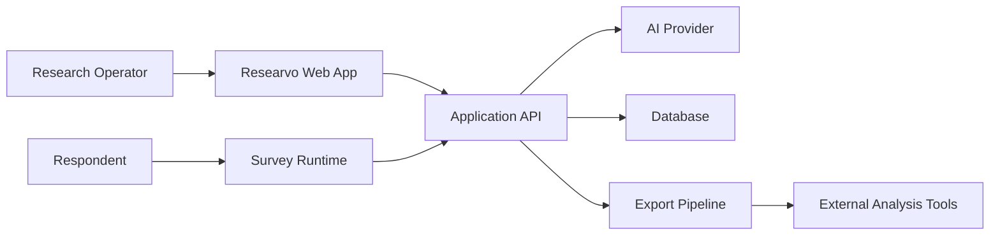
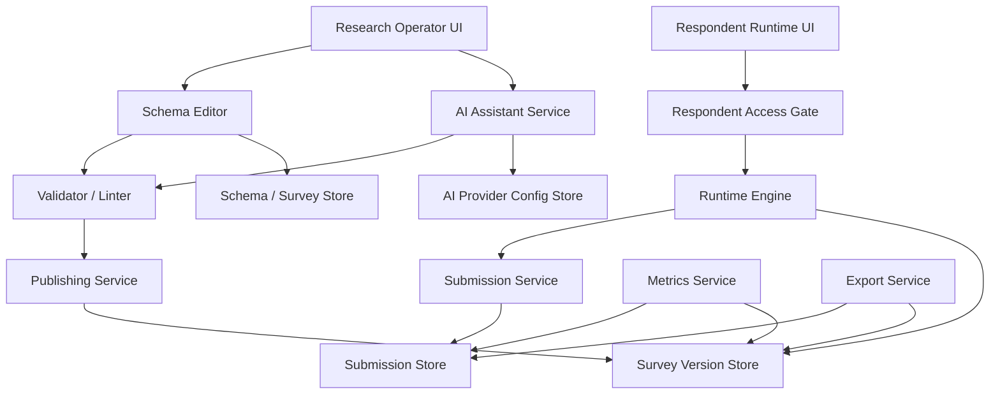
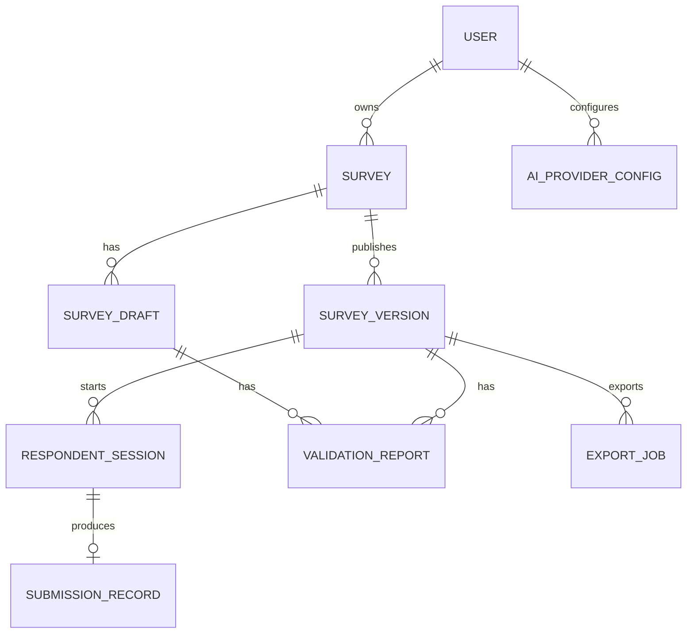
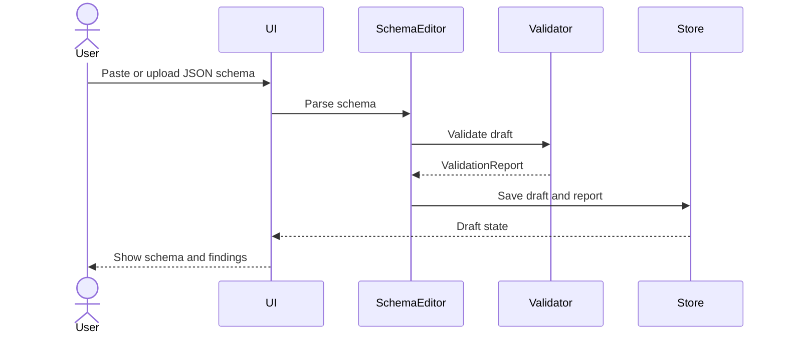
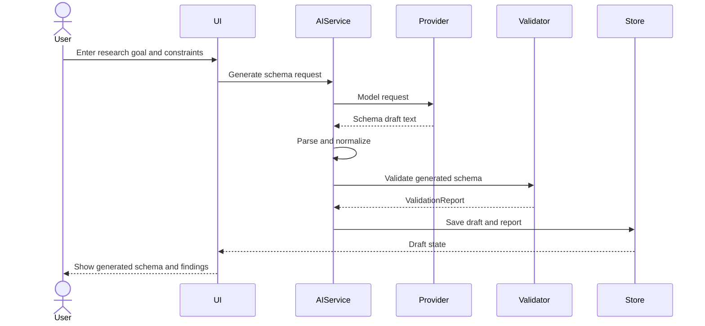
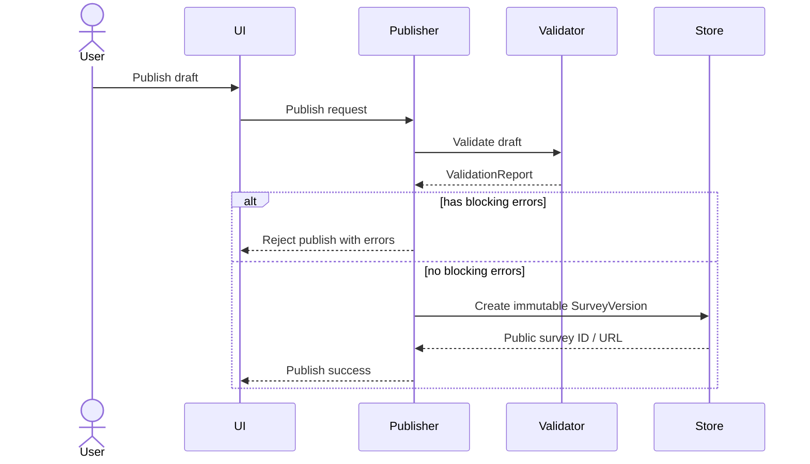
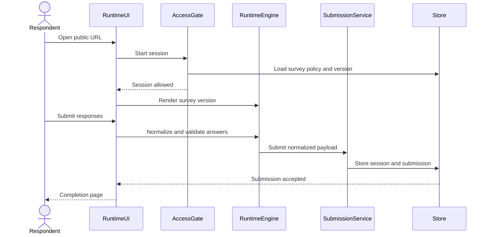
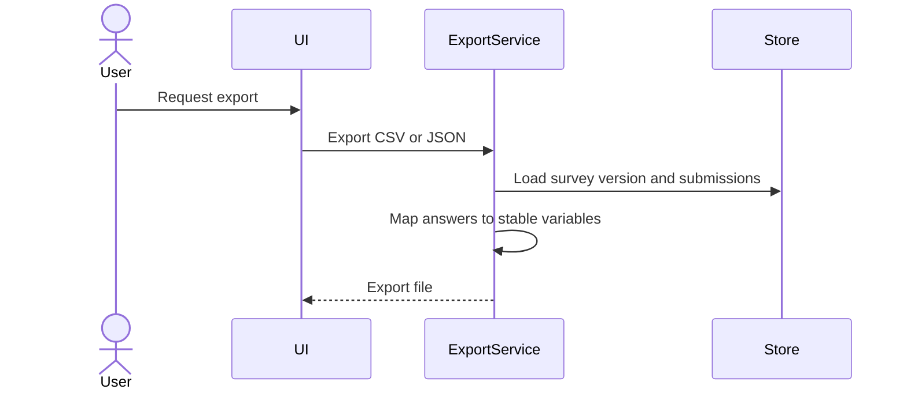

# Researvo

## System Architecture Document

Version: V0.0.1
Date: 2026-05-18
Status: Draft
Related PDD: `../pdd/2026-05-18-V0.0.1-PDD.md`
Related MVP: `../pdd/2026-05-18-V0.0.1-MVP.md`

---

## 1. Architecture Goal

Researvo is a schema-first, AI-assisted, research-grade survey platform.

The system architecture must support a small MVP while preserving the long-term product direction:

- Survey schema is the source of truth.
- Published survey versions are immutable.
- Validation and linting are first-class platform capabilities.
- AI can generate and revise drafts, but cannot bypass validation and human review.
- Respondent trust is modeled as survey policy, even when MVP defaults to anonymous access.
- Export uses stable variable definitions and coding values.

The MVP should prove an end-to-end research survey workflow:

> Create or import schema -> validate -> preview -> publish -> collect anonymous responses -> export data.

---

## 2. Architecture Principles

### 2.1 Schema-Centered System

Every major subsystem operates on the survey schema:

- Editor creates and updates schema drafts.
- AI assistant generates schema drafts.
- Validator checks schema correctness and research quality.
- Preview renders schema without storing production responses.
- Publisher freezes schema into a survey version.
- Runtime executes a published survey version.
- Exporter maps submissions back to schema variables.

### 2.2 Immutable Published Versions

Drafts may change. Published versions must not.

This is necessary for research reproducibility. If a researcher edits wording, options, coding, branch logic, or variable definitions after publication, the system should create a new version rather than mutating the existing published version.

### 2.3 Validation Before Publication

The publish path must pass through the validator.

Blocking validation errors prevent publication. Warnings and suggestions can be shown to the user without blocking publication unless policy later requires stricter behavior.

### 2.4 Policy-Based Respondent Access

All survey access should pass through a respondent access gate.

MVP supports anonymous access, but the architecture should allow future policy modes:

- Anonymous.
- OAuth.
- Invite-only.
- Organization verified.
- Proof of personhood.

### 2.5 Provider-Neutral AI

AI integration should use a provider abstraction.

The platform should support OpenAI-compatible endpoints, custom base URLs, local endpoints such as Ollama, and future provider presets without binding business logic to one model provider.

### 2.6 Open Export

Researvo should not be the final analysis environment.

Export should preserve schema metadata, stable variable names, coding values, missing value markers, version IDs, timestamps, and respondent path metadata where useful.

---

## 3. High-Level System Context



Primary users:

- Research operator creates, validates, publishes, and exports surveys.
- Respondent completes a published survey URL.
- AI provider generates or reviews draft schema content.
- External tools consume exported data.

---

## 4. Logical Architecture



The architecture separates draft-time concerns from respondent runtime concerns:

- Draft-time: schema editing, AI generation, validation, preview, publication.
- Runtime: access policy, survey execution, response validation, submission storage.
- Post-collection: metrics and export.

---

## 5. Core Modules

### 5.1 Research Operator UI

Responsibilities:

- Create survey drafts.
- Import JSON schema.
- Edit schema through basic forms or JSON-assisted editing.
- Configure AI provider.
- Generate schema with AI.
- View validation reports.
- Preview survey.
- Publish survey version.
- View basic metrics.
- Export responses and schema.

MVP UI can be simple. It does not require a full drag-and-drop flow editor.

Future expansion:

- Visual flow editor.
- Template library.
- Collaboration.
- Richer dashboards.

### 5.2 Schema Editor

Responsibilities:

- Manage survey drafts.
- Parse imported JSON.
- Normalize schema.
- Support basic editing operations.
- Preserve schema version metadata.
- Call validator after schema changes.

The editor should not directly publish or execute surveys. It works with draft schemas only.

### 5.3 AI Assistant Service

Responsibilities:

- Build model prompts from research goals, schema specification, and user constraints.
- Call configured AI provider.
- Parse AI output as schema JSON.
- Return parse errors and validation results.
- Optionally ask AI to repair invalid schema or explain validation findings.

AI output must be treated as draft content.

### 5.4 AI Provider Adapter

Responsibilities:

- Hide provider-specific API details.
- Support custom base URL and API key.
- Support OpenAI-compatible request/response shape where possible.
- Preserve enough request metadata for debugging.

Suggested interface:

```text
AIProvider.generateSchema(input) -> AISchemaDraft
AIProvider.reviewSchema(input) -> AILintFindings
AIProvider.repairSchema(input) -> AISchemaDraft
```

MVP can implement one OpenAI-compatible adapter and allow local endpoints such as Ollama if compatible.

### 5.5 Validator / Linter

Responsibilities:

- Validate schema structure.
- Validate graph connectivity and branch targets.
- Validate variable definitions.
- Validate coding schemes.
- Validate scale metadata.
- Validate missing value policies.
- Validate PII classification metadata.
- Validate randomization metadata.
- Produce structured findings.

Finding levels:

- Error: blocks publish.
- Warning: allows publish but needs attention.
- Suggestion: optional improvement.

The validator should be deterministic for structural checks. AI-assisted linting can be optional and layered on top.

### 5.6 Preview Service

Responsibilities:

- Render a draft schema as a survey.
- Allow traversal of simple branch logic.
- Show validation status.
- Avoid writing production submissions.

Preview should use the same runtime engine where possible, but with a preview context and non-production persistence.

### 5.7 Publishing Service

Responsibilities:

- Run validator.
- Block publication when errors exist.
- Create immutable SurveyVersion from a draft schema.
- Assign public survey URL or public ID.
- Preserve version metadata.

Publication is the boundary between editable draft and research data collection.

### 5.8 Respondent Access Gate

Responsibilities:

- Load survey policy.
- Decide whether a respondent can start or continue a session.
- Apply anonymous access in MVP.
- Reserve hooks for CAPTCHA, OAuth, invite codes, organization checks, proof-of-personhood, rate limits, and duplicate prevention.

MVP behavior:

- Default anonymous access.
- Create respondent session.
- Optionally store minimal fingerprint/cookie data if implemented.

### 5.9 Runtime Engine

Responsibilities:

- Load immutable survey version.
- Render consent and questions.
- Evaluate required fields.
- Evaluate simple branch rules.
- Track shown question IDs.
- Track branch path.
- Track randomization assignments if used.
- Produce normalized response payload.

MVP branch rules:

- If answer equals value, go to node.
- Otherwise continue to next node.
- End at terminal node.

Future branch rules:

- Multi-condition expressions.
- Random assignment.
- Computed variables.
- Quotas.
- Piped text.

### 5.10 Submission Service

Responsibilities:

- Create respondent sessions.
- Store partial or completed responses depending on product decision.
- Normalize missing values.
- Store branch path and shown question IDs.
- Store timing metadata.
- Bind submission to survey version.

MVP can prioritize completed submissions, but should model session and completion status separately.

### 5.11 Metrics Service

Responsibilities:

- Count started sessions.
- Count completed submissions.
- Calculate completion rate.
- Calculate average completion time.

Metrics should be derived from respondent sessions and submissions, not manually maintained when avoidable.

### 5.12 Export Service

Responsibilities:

- Export response data as CSV.
- Export response data as JSON.
- Export survey schema as JSON.
- Use stable variable names as columns.
- Preserve coding values, missing value markers, version IDs, timestamps, and completion metadata.

Future export profiles:

- Codebook.
- Stata.
- SPSS.
- R.
- Python notebook/package-friendly JSON.

---

## 6. Domain Model

### 6.1 Core Entities



### 6.2 Entity Responsibilities

`User`

- Represents a research operator.
- Owns surveys and AI provider configurations.

`Survey`

- Stable container for a research project or survey instrument.
- Owns drafts and versions.

`SurveyDraft`

- Editable schema state.
- May have parse errors or validation warnings.
- Not used for production respondent collection.

`SurveyVersion`

- Immutable published schema.
- Used by runtime, submissions, metrics, and export.

`SurveySchema`

- Structured JSON document containing metadata, consent, nodes, variables, policies, and version metadata.

`QuestionNode`

- A node in the survey graph.
- Can represent a question, consent block, instruction, section, randomization block, or terminal state.

`VariableDefinition`

- Analysis-facing variable metadata.
- Includes name, label, type, coding, scale, missing value rules, and export behavior.

`ValidationReport`

- Structured findings created by validator/linter.
- Can attach to draft or published version.

`RespondentSession`

- A respondent attempt to complete a published survey version.
- Stores started time, status, access mode, and lightweight anonymous metadata.

`SubmissionRecord`

- Submitted answer payload.
- Bound to a respondent session and survey version.

`AIProviderConfig`

- Stores provider type, base URL, and encrypted credential reference.
- Business logic should not depend on provider-specific implementation.

`ExportJob`

- Represents export requests and output metadata.
- MVP can generate exports synchronously, but the entity allows future async exports.

---

## 7. Survey Schema V0.0.1 Shape

The exact JSON Schema should be defined in the implementation plan. Architecturally, it should contain these top-level sections:

```json
{
  "schemaVersion": "0.0.1",
  "survey": {},
  "policy": {},
  "consent": {},
  "variables": [],
  "nodes": [],
  "edges": [],
  "metadata": {}
}
```

Recommended responsibilities:

`schemaVersion`

- Identifies the schema contract used by parser, validator, runtime, and exporter.

`survey`

- Title, description, language, owner-facing research metadata.

`policy`

- Access mode, duplicate policy, CAPTCHA policy, PII policy, data retention hints.

`consent`

- Consent title, body, required flag, withdrawal information, contact information.

`variables`

- Stable variable definitions used for export and analysis.

`nodes`

- Runtime survey nodes.

`edges`

- Explicit survey graph transitions.

`metadata`

- Custom properties, domain templates, tags, provenance, and AI generation metadata.

---

## 8. Key Data Flows

### 8.1 Import Schema Flow



### 8.2 AI Generate Schema Flow



### 8.3 Publish Flow



### 8.4 Respondent Submission Flow



### 8.5 Export Flow



---

## 9. Validation Architecture

The validator should be layered.

### 9.1 Structural Validation

Checks whether the schema is well-formed:

- Required top-level fields exist.
- Node IDs are unique.
- Variable names are unique.
- Question types are supported.
- Branch targets exist.

### 9.2 Graph Validation

Checks survey flow:

- Entry node exists.
- Nodes are reachable.
- Terminal paths exist.
- Obvious cycles are detected.
- Unreferenced nodes are flagged.

### 9.3 Research Metadata Validation

Checks research-grade properties:

- Closed-choice options have stable coding values.
- Scale questions define scale metadata.
- Missing value policy exists or default is explicit.
- Randomization records assignment metadata.
- Variable labels and types are present.

### 9.4 Privacy And Consent Validation

Checks respondent protection metadata:

- Consent block exists or warning is shown.
- PII-like fields are classified.
- PII policy exists when PII fields are collected.

### 9.5 AI-Assisted Linting

Optional layer for research wording and bias:

- Leading question phrasing.
- Double-barreled questions.
- Sensitive wording.
- Ambiguous options.
- Inconsistent constructs.

AI-assisted findings should be suggestions or warnings unless later product policy decides otherwise.

---

## 10. Runtime Architecture

The runtime engine executes an immutable survey version.

Runtime input:

- SurveyVersion.
- SurveyPolicy.
- RespondentSession.
- Current node.
- Existing answers.

Runtime output:

- Renderable node.
- Validation errors for current answer.
- Next node.
- Branch path updates.
- Normalized answer values.
- Missing value markers.

MVP runtime should avoid complex expression evaluation. A simple branch evaluator is enough:

```text
if answer equals value -> goto target node
else -> default next node
```

The expression evaluator should be isolated so future versions can support richer logic without rewriting the whole runtime.

---

## 11. Data Persistence Strategy

The PDD recommends PostgreSQL because of relational integrity and JSONB support.

Recommended storage approach:

- Use relational tables for high-value entities: users, surveys, drafts, versions, sessions, submissions, validation reports, AI provider configs.
- Store survey schema JSON in a JSONB-like field where available.
- Extract important query fields into columns: survey ID, version ID, status, owner ID, created time, published time.
- Store response payload as structured JSON while preserving export-friendly mappings.

This hybrid approach keeps the schema flexible while allowing reliable querying and export.

---

## 12. API Boundary

MVP API groups:

`/api/surveys`

- Create survey.
- List surveys.
- Get survey.

`/api/surveys/{surveyId}/draft`

- Get draft.
- Update draft.
- Import schema.
- Validate draft.

`/api/surveys/{surveyId}/ai`

- Generate schema.
- Review schema.
- Repair schema.

`/api/surveys/{surveyId}/publish`

- Publish draft as immutable version.

`/api/public/s/{publicId}`

- Load published survey for respondent runtime.

`/api/public/s/{publicId}/sessions`

- Start respondent session.

`/api/public/s/{publicId}/submissions`

- Submit survey response.

`/api/surveys/{surveyId}/metrics`

- Get basic collection metrics.

`/api/surveys/{surveyId}/exports`

- Export CSV.
- Export JSON.
- Export schema JSON.

The implementation may choose route handlers, server actions, or another framework-specific style, but these boundaries should remain conceptually clear.

---

## 13. Security And Privacy Considerations

MVP should account for:

- API keys must not be exposed to respondent clients.
- AI provider credentials should be encrypted or stored through a secure secret mechanism.
- Respondent submissions should bind to immutable survey versions.
- PII fields must be classified in schema metadata.
- Exports should clearly include or exclude PII according to future policy.
- Public survey URLs should use unguessable IDs.
- Anonymous access should still pass through the access gate.
- Rate limiting and CAPTCHA should remain policy-level extension points.

MVP can defer advanced compliance, but should avoid architecture that makes privacy controls difficult later.

---

## 14. Extensibility Points

### 14.1 Question Types

Add question types through a registry:

- Schema definition.
- Renderer.
- Answer validator.
- Export mapper.
- Linter rules.

### 14.2 Branch Logic

Keep expression evaluation isolated:

- MVP simple equality rules.
- Future expression DSL.
- Future computed variables.
- Future randomization and treatment assignment.

### 14.3 AI Providers

Add provider adapters behind a common interface.

### 14.4 Identity And Trust

Add trust providers behind respondent access gate:

- CAPTCHA.
- OAuth.
- Invite codes.
- Organization accounts.
- Proof-of-personhood.

### 14.5 Export Profiles

Add export profiles without changing submission storage:

- CSV.
- JSON.
- Codebook.
- Stata.
- SPSS.
- R.

### 14.6 Domain Templates

Add templates as schema presets:

- Economics student survey.
- Social science Likert survey.
- UX feedback survey.
- Market screening survey.
- Consent-heavy academic study.

---

## 15. Suggested Technology Direction

The PDD suggests:

- Next.js.
- TypeScript.
- Tailwind CSS.
- shadcn/ui.
- React Flow for future visual editor.
- PostgreSQL.
- OpenAI-compatible AI interface.

Architecture implications:

- Use TypeScript types or generated types for Survey Schema V0.0.1.
- Use a schema validation library for runtime validation of survey schema.
- Keep domain logic outside UI components.
- Keep validator, runtime engine, exporter, and AI provider adapters as independently testable modules.
- Defer React Flow until basic schema and runtime behavior are stable.

---

## 16. MVP Build Slices

This architecture suggests these implementation slices:

1. Define Survey Schema V0.0.1.
2. Implement parser and deterministic validator.
3. Implement survey draft storage.
4. Implement basic editor/import UI.
5. Implement preview runtime.
6. Implement publishing and immutable versions.
7. Implement anonymous respondent runtime.
8. Implement submission storage.
9. Implement basic metrics.
10. Implement CSV/JSON export.
11. Implement AI provider abstraction and schema generation.

This is not the detailed implementation plan, but it shows the intended build order.

---

## 17. Architecture Decisions

### ADR-001: Survey Schema Is The Source Of Truth

Decision:

All rendering, validation, publication, runtime execution, and export should derive from the survey schema.

Reason:

This keeps AI generation, manual editing, runtime behavior, and export aligned.

### ADR-002: Published Versions Are Immutable

Decision:

Publishing creates an immutable SurveyVersion.

Reason:

Research data must remain comparable and reproducible.

### ADR-003: Validator Blocks Publication On Errors

Decision:

The publishing service must run validation and block publication when errors exist.

Reason:

Researvo's core differentiation depends on research-grade schema quality.

### ADR-004: Trust Is Policy-Based

Decision:

Survey access must go through a RespondentAccessGate even when collection is anonymous.

Reason:

This preserves a clean extension path for OAuth, invite-only, organization verification, CAPTCHA, and proof-of-personhood.

### ADR-005: AI Output Is Draft Content

Decision:

AI-generated schema must be parsed, validated, and reviewed before publication.

Reason:

AI should assist survey design but should not silently define statistical instruments.

---

## 18. Open Architecture Questions

1. Should MVP require research operator accounts, or start with a single-user/local mode?
2. What exact JSON Schema should define Survey Schema V0.0.1?
3. Which schema validation library should be used?
4. Should draft autosave be implemented in MVP?
5. Should respondent partial responses be stored before completion?
6. How much AI linting should be deterministic versus model-assisted?
7. Should API keys be stored persistently in MVP, or entered per session?
8. Should anonymous duplicate prevention be implemented immediately or left as policy metadata?
9. Should codebook export be part of MVP or the first post-MVP feature?
10. Should preview and respondent runtime share the exact same engine from the first implementation?

---

## 19. Next Step

The next artifact should be an implementation plan based on:

- PDD V0.0.1.
- MVP Requirements V0.0.1.
- This System Architecture V0.0.1.

The implementation plan should start by defining Survey Schema V0.0.1 and then build the validator, runtime engine, persistence model, and export pipeline around it.

---

## 20. MVP Implementation Decisions

The first implementation made these concrete choices:

- `SurveySchema` is a strict Zod contract in `lib/schema/surveySchema.ts`; custom flexibility is held in explicit `metadata` records.
- Branch rules are discriminated by operator. Runtime execution supports `equals`, `not_equals`, `in`, `not_in`, `exists`, and `missing`.
- Runtime reachability is based on `nextNodeId` and `branches[].goto`; `edges` remain visual/structural metadata.
- Prisma is pinned to version 6 because Prisma 7 changed environment variable handling for datasource URLs in a way that blocked this local setup.
- Repository functions live in `lib/persistence/repositories.ts` and expose a small persistence boundary for API routes.
- Anonymous collection is the only implemented respondent access mode, but all public sessions still pass through the access gate.
- AI integration is provider-neutral through an OpenAI-compatible adapter with custom `baseUrl`, `apiKey`, and `model`.
- Playwright E2E coverage exists but requires a configured PostgreSQL `DATABASE_URL`.
